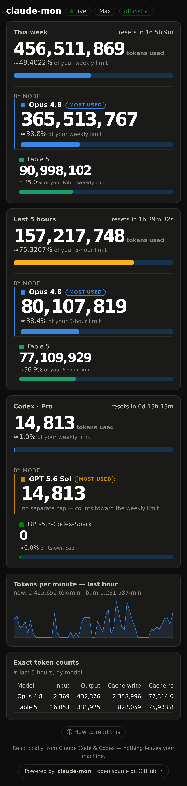

# claude-mon

**A live, local dashboard for your Claude Code / Claude subscription usage — and
your OpenAI Codex CLI usage too.** Exact token counts and your official limit
percentages, ticking in real time — no API keys, no third‑party services, nothing
leaves your machine.

<p align="center">
  
</p>

## What it shows

- **This week** and **Last 5 hours** — the two rolling usage windows Claude
  enforces. Each card leads with your **exact token count**, shows the
  **approximate % of that window's limit** below it, a usage meter, and a
  **per‑model breakdown** (most‑used model featured, the rest in descending order).
- **Per‑model weekly caps** — if a model has its own separate weekly limit (e.g.
  the newest model on Max plans), it's shown as a distinct pill on that model's row.
- **Codex (OpenAI)** — if the Codex CLI is installed and logged in, a matching
  card appears automatically: exact local tokens from `~/.codex/sessions`,
  official window percentage and per‑model caps from your own ChatGPT login
  (the same data `codex /status` shows). No configuration.
- **Burn rate** and a **per‑minute sparkline** for the last hour.
- An **exact per‑model table** (input / output / cache read / cache write).

The big token counts roll upward like an odometer and only ever increase; the
percentages tick with several decimals and re‑sync to the official figure on each
refresh.

## How it works (two local sources, zero network egress of your data)

1. **Transcripts** — Claude Code writes every turn to `~/.claude/projects/**/*.jsonl`
   with exact token usage. claude-mon tails these for live, per‑model counts.
2. **Claude Code's own usage endpoint** — called locally with the OAuth token
   already in `~/.claude/.credentials.json` and the `claude-code` User‑Agent (the
   same call the built‑in `/usage` makes). It returns your **official** session /
   weekly / per‑model utilization and reset times.

Anthropic doesn't publish the raw token *limits*, only coarse percentages. So
claude-mon **calibrates**: it anchors your exact token count to the official
percentage, giving you a precise, ticking number that stays true to the official
figure. Your plan (Pro / Max 5x / Max 20x) is auto‑detected from your credentials.

## Requirements

- **Python 3.8+** — standard library only, nothing to `pip install`.
- **Claude Code** installed and logged in **on the same machine** (claude-mon
  reads its local files; it must run where Claude Code runs).

## Quick start

```bash
git clone https://github.com/tomasen/claude-mon.git
cd claude-mon
python3 server.py
```

Open **http://127.0.0.1:8420**. That's it — it detects your plan, reads your
official usage, and starts ticking. `Ctrl‑C` stops it. Force a theme with
`?theme=dark` / `?theme=light`.

### Or just ask your AI to install it

Using Claude Code, Codex CLI, or any AI coding agent? Paste this prompt and
you're done:

> Install claude-mon from https://github.com/tomasen/claude-mon — clone the
> repo, start its server, and confirm the dashboard loads at
> http://127.0.0.1:8420. Then set it up to start automatically on boot
> (systemd, launchd, or whatever this machine uses) so it runs permanently.

## Run on boot (persistence)

A bare `python3 server.py` stops on reboot and nothing restarts it. To keep it
running, install the included **systemd user service** (no root needed):

```bash
mkdir -p ~/.config/systemd/user
cp claude-mon.service ~/.config/systemd/user/     # edit paths if you didn't clone to ~/claude-mon
systemctl --user daemon-reload
systemctl --user enable --now claude-mon
loginctl enable-linger "$USER"                    # keep running after logout / across reboots
```

Manage it: `systemctl --user status claude-mon` · `journalctl --user -u claude-mon -f`
· disable with `systemctl --user disable --now claude-mon`.

## Configuration

| Flag | Default | Meaning |
|---|---|---|
| `--port` | `8420` | HTTP port |
| `--host` | `127.0.0.1` | bind address (localhost only — see security note) |
| `--dir` | `~/.claude/projects` | transcripts location |
| `--usage-poll` | `60` | seconds between official‑usage polls (it rate‑limits; don't go low) |
| `--no-usage` | off | disable the endpoint — transcripts only, percentages become estimates |
| `--plan` | auto | override plan preset (`pro`/`max5`/`max20`) for the fallback estimate |
| `--limit` | auto | override the fallback tokens‑per‑5h estimate |

## Accuracy

- **Token counts are exact** — read straight from Claude Code's logs.
- **Percentages are approximate** (shown with a `≈`) — the underlying limits aren't
  published, so they're the official percentage sharpened with your exact tokens.
  Read a percentage as "about right," a token count as exact.

## Privacy & caveats

- **Everything is computed locally.** claude-mon serves only to `127.0.0.1` by
  default. Don't bind it to a public interface — it displays your usage.
- It calls Claude Code's **unofficial** OAuth usage endpoint (read‑only, your own
  token, polled about once a minute). This is the same data `/usage` shows; use at
  your own discretion. Run with `--no-usage` to avoid it entirely (you keep exact
  token counts, but percentages fall back to rough estimates).
- Not affiliated with or endorsed by Anthropic.

## Built by Claude, watching itself

claude-mon was built end‑to‑end in a single Claude Code session — about **450
assistant turns** and **~110M tokens** (mostly cache reads of the ever‑growing
context; ~1.3M of them actual output) — with the dashboard running the whole time,
watching its own construction eat into the session and weekly limits.

## License

MIT — see [LICENSE](LICENSE).
